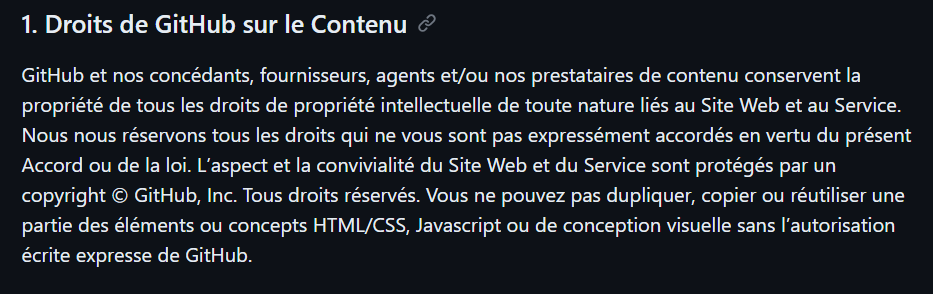

# Fetch_github_api

## Contexte du projet
Notre entreprise est intéressée par l'obtention d'informations précieuses sur les dépôts de code hébergés sur GitHub. L'objectif est de mieux comprendre les tendances de développement, les langages de programmation les plus utilisés, d'identifier des projets intéressants, de suivre les évolutions technologiques et d'explorer de potentielles opportunités de collaboration. Pour atteindre ces objectifs, nous souhaitons développer un projet data qui nous permettra d'identifier les informations pertinentes sur GitHub.

## Tache pour la semaine 1
En tant que développeur de données, votre première tâche consistera à naviguer sur le web afin d'effectuer une collecte de données GitHub pertinente.

## Définir les objectifs 
 - Connaitre les langages de programmation les plus utilisés
 - Identifier des projets intéressants
 - Veiller sur l'évolution technologique 
 - Ciblé les opportunité de collaboration

## Planification du travail à effectuer
### Plan Individuel
#### La plateforme
Comprendre l'organisation de la plateforme Github en se basant sur nos besoin est un point crucial. 
De ce fait après quelques recherches, on peut distinguer plusieurs types de recherche telles que des recherches par utilisateurs, par organisations, par dépots...
J'ai préferer me baser sur la recherche par dépots pour adapter à mes besoins. 
En effet dans un dépot, on peut trouver des contributeurs, des langages de programmation utilisés, la date de création et plein d'autres informations utiles.

#### La collecte
Il existe différentes méthodes de collecte de données dans le web, comme le web scrapping, la collecte dépuis une API (Application Programming Interface), collecte dépuis une banque de données publique ou privé...
La plupart des services web fournissent des API pour aider à la collecte des données. Ces dernières peuvent être payantes ou gratuites dépendants du préstataire. L'avantage d'une API, est que généralement les données sont plus fiables et structurées.
Le web scrapping peut s'avérer utile dans la mésure ou elle te laisse la main à la patte. C'est a dire que suivant la méthode que vous utilisé, vous pouvez cibler des informations particulières.
Néanmoins, ce n'est pas tous les sites qui autorise cette méthode dans leur services. Il faut donc prendre en considération les législation et l'éthique des données et des sites web.

Github n'autorise pas l'éxtraction des données dépuis sa plateforme

Lors de la collecte je me suis basé sur le nombre d'étoiles comme critères de sélection mais cela me récupère bien sur toutes les autres informations associés au dépots.

### Plan Equipe
Savoir comment chacun avance est très important dans la mésure où ça aide à mieux intéragir et résoudre des problème en équipe.
Comprendre les méthodes et suggestion de chacun pour filtrer la solution éfficiente.

## Pratique
J'ai utilisé une structure assez répandu qui est le MVC (Model View Controller). Cette structure aide à mieux organiser le code et à partager les différentes taches de façon logique et coordonnée.

### Src
Ce dossier correspond au coeur du projet. Il contient le model ainsi que le controleur.
#### Model
Dedans, on trouve une fonction qui fait la connexion et la récolte des données dépuis l'API REST de Github en se basant sur la recherche de dépots. La fonction retourne une liste contenant les informations récueillies
#### Controleur
Il contient deux fonctions : 
 - Une qui fait appel au model pour récuperer les données en spécifiant la requette
 - Une autre qui supprime les données répetées et stock les informations dans un fichier csv

### Config
Ce dossier contient deux fichiers à savoir conf.py et helpers.py
#### conf.py 
Ce fichier contient des constantes de configuration tels que l'url de recherche
#### helpers.py 
Contient des fonctions qui aide le controleur pour quelques taches

### Public
Pour stocker les images

### main.py
C'est le point d'entrée de notre projet. Il joue le role du routeur, Il se charge d'appeler le bon controleur quand il le faut.

## Problème rencontré
L'API REST de github limite les requettes jusqu'a 10 ou 30 (avec authentification) requetes par minutes avec un total de 1000 résultats.
La réponse d'une requete contient 1000 lignes organisé par page. Une page peut avoir jusqu'a 100 lignes maximum. Il y'a donc 10 pages par requete.

Pour récuperer plus de données j'ai procédé comme suit :
 - Implémenter un système de pagination pour parcourir toutes les pages d'une requete;
 - Patienter 1 min avant de lancer une requete
 - 
### Exécution
Télecharger le projet en faisant "git clone https://github.com/Sefdine/Fetch_github_api.git", Cela vous donnera une copie du projet en local.
Assuré vous d'avoir python installé dans votre machine. 
Dans la console, taper la commande "python main.py" sous windows ou "python3 main.py" sous linux.
Le programme vous demandera d'entré votre token pour vous authentifier à l'API REST de Github. 
Après avoir soumis votre token, le programme chargera la première requete qui est :
 - Récuperer dépots avec toutes les informations associé en triant par nombre de stars décendant. C'est à dire les premier dépots les mieux notés en nombre détoiles.
Puis il vous demandera si vous voulez continuer à récuperer les données : 
 - Si non le programme passera à l'étape suivante en conservant vos 1000 lignes.
 - Si oui, il patientra 1 min et lancer une autre requete pour récuperer 1000 autres, vous aurez donc 2000 lignes (ainsi de suite)

N'ésiter pas à ajouter des fonctionnalité, si vous voulez contribuer :
Créer une autre branch, et faire vos modifications. Vous pouvez faire un pull-request pour soumettre vos modifications.

Merci beaucoup !
