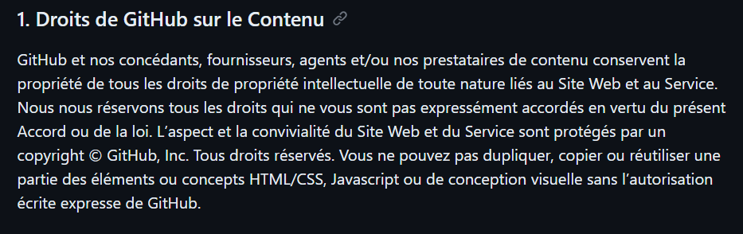

# Fetch_github_api

## Contexte du projet
Notre entreprise est intéressée par l'obtention d'informations précieuses sur les dépôts de code hébergés sur GitHub. L'objectif est de mieux comprendre les tendances de développement, les langages de programmation les plus utilisés, d'identifier des projets intéressants, de suivre les évolutions technologiques et d'explorer de potentielles opportunités de collaboration. Pour atteindre ces objectifs, nous souhaitons développer un projet data qui nous permettra d'identifier les informations pertinentes sur GitHub.

## Tache pour la semaine 1
En tant que développeur de données, votre première tâche consistera à naviguer sur le web afin d'effectuer une collecte de données GitHub pertinente.

## Définir les objectifs 
 - Connaitre les langages de programmation les plus utilisés
 - Identifier des projets intéressants
 - Veiller sur l'évolution technologique 
 - Ciblé les opportunité de collaboration

## Planification du travail à effectuer
### Plan Individuel
#### La plateforme
Comprendre l'organisation de la plateforme Github en se basant sur nos besoin est un point crucial. 
De ce fait après quelques recherches, on peut distinguer plusieurs types de recherche telles que des recherches par utilisateurs, par organisations, par dépots...
J'ai préferer me baser sur la recherche par dépots pour adapter à mes besoins. 
En effet dans un dépot, on peut trouver des contributeurs, des langages de programmation utilisés, la date de création et plein d'autres informations utiles.

#### La collecte
Il existe différentes méthodes de collecte de données dans le web, comme le web scrapping, la collecte dépuis une API (Application Programming Interface), collecte dépuis une banque de données publique ou privé...
La plupart des services web fournissent des API pour aider à la collecte des données. Ces dernières peuvent être payantes ou gratuites dépendants du préstataire. L'avantage d'une API, est que généralement les données sont plus fiables et structurées.
Le web scrapping peut s'avérer utile dans la mésure ou elle te laisse la main à la patte. C'est a dire que suivant la méthode que vous utilisé, vous pouvez cibler des informations particulières.
Néanmoins, ce n'est pas tous les sites qui autorise cette méthode dans leur services. Il faut donc prendre en considération les législation et l'éthique des données et des sites web.

Github n'autorise pas l'éxtraction des données dépuis sa plateforme

Lors de la collecte je me suis basé sur le nombre d'étoiles comme critères de sélection mais cela me récupère bien sur toutes les autres informations associés au dépots.
